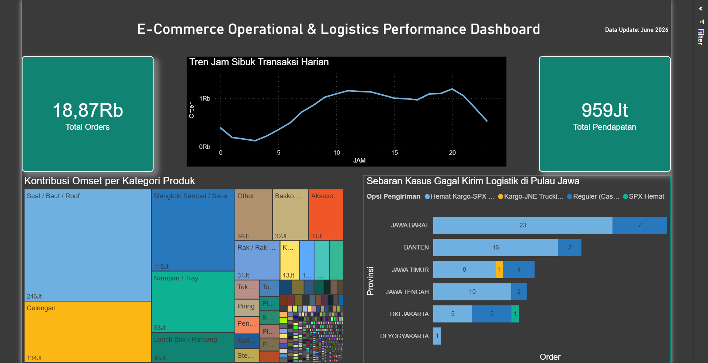

# E-Commerce Operational & Logistics Performance Dashboard

## 📌 Project Overview
Proyek ini bertujuan untuk membangun dashboard analitik interaktif berskala perusahaan menggunakan Power BI untuk memonitor performa penjualan, tren transaksi harian, serta menganalisis titik masalah pada rantai pasok (logistik) pengiriman barang di Pulau Jawa.

---

## 🖥️ Dashboard Preview

🔗 **[Klik di Sini untuk Mengakses Live Interactive Dashboard](https://app.powerbi.com/links/XzMink3PUB?ctid=2d943f59-5fb7-4ba4-853c-49256bf4706a&pbi_source=linkShare&bookmarkGuid=10595d3c-d487-4d9d-8433-9d4696ee6b50)**

> 💡 **Catatan Akses:** Karena dashboard ini di-publish menggunakan infrastruktur organisasi institusi yang aman, Anda mungkin akan diarahkan ke halaman **"Request Access"** saat membukanya. Silakan klik tombol tersebut, dan saya akan segera menyetujui permintaan akses Anda untuk keperluan review portofolio.

---

## 🛠️ Tech Stack & Skills
* **Tools:** Power BI Desktop, Power BI Service (Cloud)
* **Data Transformation:** Power Query
* **Data Modeling & Calculations:** DAX (Data Analysis Expressions)
* **Data Visualization:** F-Shape Dashboard Layout Pattern, Dark Theme Configuration

---

## 📊 Key Insights & Business Recommendations

### 1. Tren Jam Sibuk Transaksi Harian (Hourly Order Trend)
* **Insight:** Aktivitas transaksi pelanggan memiliki pola *double-peak*. Lonjakan pertama terjadi pada jam istirahat siang (11.00–13.00) dan mencapai puncak tertinggi harian pada malam hari menjelang tidur (19.00–21.00). 
* **Rekomendasi Bisnis:** Tim Marketing dapat memanfaatkan momentum ini dengan menjadwalkan kampanye promo kilat (Flash Sale), voucher gratis ongkir terbatas, atau pengiriman *push notification* tepat pada jam-jam sibuk tersebut untuk memaksimalkan angka konversi penjualan (*conversion rate*).

### 2. Kontribusi Omset per Kategori Produk (Revenue Analysis)
* **Insight:** Dari total pendapatan sebesar **Rp 959 Juta**, kategori produk **Seal / Baut / Roof** menjadi kontributor pendapatan terbesar yang mendominasi portfolio bisnis perusahaan.
* **Rekomendasi Bisnis:** Tim Operasional dan Supply Chain wajib menjaga tingkat ketersediaan stok (*safety stock*) pada kategori produk utama ini untuk menghindari risiko kehilangan potensi penjualan akibat kehabisan barang (*stockout*).

### 3. Sebaran Kasus Gagal Kirim Logistik di Pulau Jawa
* **Insight:** Provinsi **Jawa Barat** memegang angka kasus kegagalan pengiriman tertinggi (total 30 kasus). Berdasarkan analisis kurir, layanan **SPX Hemat** menjadi kontributor masalah terbesar di hampir seluruh wilayah provinsi di Pulau Jawa.
* **Rekomendasi Bisnis:** Manajemen operasional perlu melakukan evaluasi ketat terhadap SLA (*Service Level Agreement*) dari mitra logistik SPX Hemat. Sebagai solusi jangka pendek untuk menjaga kepuasan pelanggan, alokasi pengiriman di wilayah kritis seperti Jawa Barat dapat dialihkan sementara ke mitra logistik lain yang memiliki performa lebih stabil (seperti JNE Trucking).
